# PaperTrader - System Architecture Documentation

## Table of Contents
1. [Deployment Architecture](#deployment-architecture)
2. [Application Architecture](#application-architecture)
3. [Database Schema](#database-schema)
4. [API Architecture](#api-architecture)
5. [Data Flow Diagrams](#data-flow-diagrams)
6. [Technology Stack](#technology-stack)

---

## Deployment Architecture

```mermaid
graph TB
    subgraph "Internet"
        User[👤 Users/Web Browsers]
    end

    subgraph "Docker Network"
        subgraph "Reverse Proxy Layer"
            Caddy[Caddy<br/>Port: 80/443<br/>Reverse Proxy<br/>& TLS Termination]
        end

        subgraph "Application Layer"
            Frontend[Frontend Container<br/>React Application<br/>Port: 3000]
            Backend[Backend Container<br/>Go HTTP Server<br/>Port: 8080<br/>Gorilla Mux Router]
        end

        subgraph "Data Layer"
            PostgreSQL[(PostgreSQL 15<br/>Port: 5432<br/>Transactional Data)]
            Redis[(Redis 7<br/>Port: 6379<br/>Cache & Rate Limiting)]
        end
    end

    subgraph "External Services"
        MarketStack[MarketStack API<br/>Stock Price Data<br/>External HTTP API]
    end

    User -->|HTTPS/HTTP| Caddy
    Caddy -->|HTTP| Frontend
    Caddy -->|HTTP| Backend
    Backend <-->|SQL Queries<br/>ACID Transactions| PostgreSQL
    Backend <-->|Cache Operations<br/>Rate Limiting| Redis
    Backend -->|HTTP API Calls| MarketStack

    style PostgreSQL fill:#336791,color:#fff
    style Redis fill:#DC382D,color:#fff
    style Caddy fill:#0CAD0C,color:#fff
    style Backend fill:#00ADD8,color:#fff
    style Frontend fill:#61DAFB,color:#333
```

---

## Application Architecture

---

## Database Schema

### Table Details

#### users
- **Purpose**: User accounts and authentication
- **Key Fields**:
  - `id`: UUID primary key
  - `email`: Unique email address
  - `password`: Bcrypt hashed password (cost factor 12)
  - `balance`: Starting balance $10,000.00

#### trades
- **Purpose**: Audit log of all buy/sell transactions
- **Key Fields**:
  - `id`: UUID primary key
  - `user_id`: Foreign key to users
  - `symbol`: Stock symbol (e.g., "AAPL")
  - `action`: "BUY" or "SELL"
  - `status`: Transaction status

#### portfolio
- **Purpose**: Current holdings per user
- **Key Fields**:
  - `id`: UUID primary key
  - `user_id`: Foreign key to users
  - `symbol`: Stock symbol
  - `quantity`: Number of shares
  - `avg_price`: Weighted average purchase price
  - Unique constraint on (user_id, symbol)

---

## API Architecture

### API Endpoint Summary

| Method | Endpoint | Authentication | Description |
|--------|----------|----------------|-------------|
| POST | `/api/account/register` | None | User registration |
| POST | `/api/account/login` | None | User login (returns JWT) |
| POST | `/api/account/logout` | JWT | User logout |
| GET | `/api/account/profile` | JWT | Get user profile |
| GET | `/api/account/auth` | JWT | Check authentication status |
| GET | `/api/account/balance` | JWT | Get user balance |
| POST | `/api/account/update-balance` | JWT | Update user balance |
| GET | `/api/account/users` | JWT | Get all users (admin) |
| GET | `/api/market/stock` | JWT + Rate Limit | Get current stock price |
| GET | `/api/market/stock/historical/daily` | JWT + Rate Limit | Get historical stock data |
| POST | `/api/market/stock` | JWT + Rate Limit | Create stock entry |
| DELETE | `/api/market/stock/symbol` | JWT + Rate Limit | Delete stock by symbol |
| POST | `/api/investments/buy` | JWT | Buy stock shares |
| POST | `/api/investments/sell` | JWT | Sell stock shares |
| GET | `/api/investments` | JWT | Get user portfolio holdings |

---

## Data Flow Diagrams

### Authentication Flow

### Buy Stock Transaction Flow (ACID)

### Market Data Caching Flow

### Rate Limiting Flow

---

## Technology Stack

### Frontend
- **Framework**: React (JavaScript)
- **HTTP Client**: Fetch API / Axios
- **Routing**: React Router (implied)
- **Build Tool**: Create React App / npm

### Backend
- **Language**: Go 1.23
- **HTTP Framework**: Gorilla Mux
- **Database Driver**: lib/pq (PostgreSQL)
- **Cache/Queue**: go-redis/v9
- **Authentication**: JWT (golang-jwt/jwt/v5)
- **Password Hashing**: golang.org/x/crypto/bcrypt

### Infrastructure
- **Reverse Proxy**: Caddy 2
- **Containerization**: Docker & Docker Compose
- **Database**: PostgreSQL 15-alpine
- **Cache**: Redis 7-alpine

### External Services
- **Market Data**: MarketStack API (REST)

### Security Features
- JWT-based authentication
- Bcrypt password hashing (cost factor 12)
- CORS middleware
- Rate limiting (sliding window, per-user and per-IP)
- SQL injection protection (parameterized queries)
- ACID transactions for financial operations

---

## Key Architectural Decisions

### 1. ACID Transactions for Financial Operations
- All buy/sell operations execute within a single PostgreSQL transaction
- Ensures atomicity: balance update + trade record + portfolio update happen together
- Eliminates distributed transaction issues from previous MongoDB architecture

### 2. Redis Caching Strategy
- **Stock Prices**: 15-minute TTL (balances freshness with API costs)
- **Historical Data**: 24-hour TTL (daily data changes once per day)
- **Rate Limiting**: Sliding window using Redis sorted sets

### 3. Materialized Portfolio Table
- Portfolio holdings stored as a materialized table in PostgreSQL
- Updated atomically with trades in the same transaction
- Eliminates need to recalculate from trade history

### 4. Service Layer Pattern
- Business logic separated from HTTP handlers
- Services are testable and reusable
- Clean separation of concerns: API → Service → Data

### 5. DBTX Interface
- Common interface for `*sql.DB` and `*sql.Tx`
- Enables transaction support across all data stores
- Allows services to manage transactions without tight coupling

---

## Performance Considerations

### Caching
- Stock prices cached for 15 minutes (reduces MarketStack API calls)
- Historical data cached for 24 hours (daily data)
- Redis in-memory storage provides sub-millisecond response times

### Database
- PostgreSQL connection pooling (25 max connections, 5 idle)
- Indexed queries on `user_id` in portfolio and trades tables
- Unique constraint on `(user_id, symbol)` in portfolio for fast lookups

### Rate Limiting
- Per-user limit: 100 requests/hour
- Per-IP limit: 200 requests/hour
- Sliding window algorithm for accurate time-based limiting

---

## Scalability Notes

### Current Architecture
- Monolithic backend application
- Single PostgreSQL instance
- Single Redis instance
- Suitable for small to medium traffic

### Potential Improvements
- **Horizontal Scaling**: Add backend replicas behind load balancer
- **Database**: Read replicas for read-heavy workloads
- **Cache**: Redis Cluster for high availability
- **Message Queue**: Add queue system for async operations (e.g., email notifications)

---

## Deployment Notes

### Docker Compose Services
1. **caddy**: Reverse proxy and TLS termination
2. **frontend**: React application (built as static assets)
3. **backend**: Go HTTP server
4. **postgres**: PostgreSQL database with persistent volume
5. **redis**: Redis cache with persistent volume

### Health Checks
- PostgreSQL: `pg_isready` command
- Redis: `redis-cli ping` command
- Backend depends on database health before starting

### Environment Variables
- `DATABASE_URL`: PostgreSQL connection string
- `REDIS_URL`: Redis connection string
- `MARKETSTACK_API_KEY`: External API key
- `JWT_SECRET`: Secret for JWT signing
- `FRONTEND_URL`: CORS allowed origin

---

*Last Updated: After PostgreSQL Migration*  
*Architecture Version: 2.0 (PostgreSQL + Redis)*
