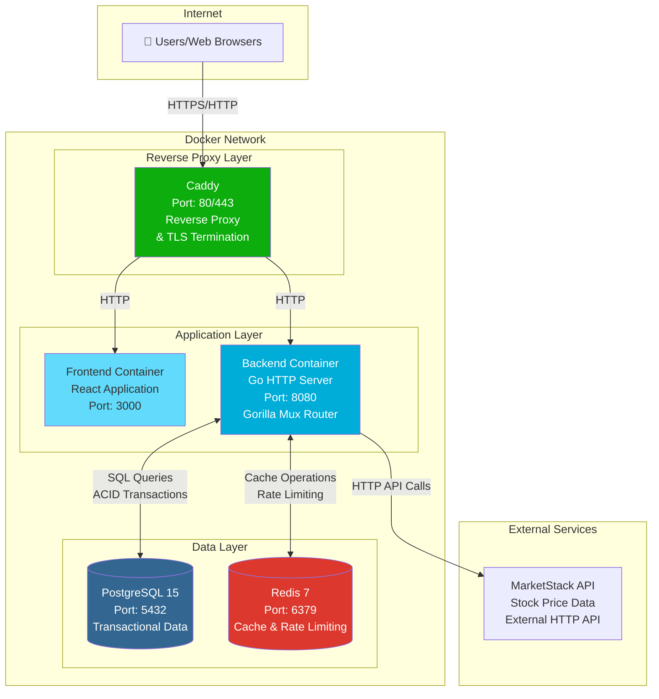
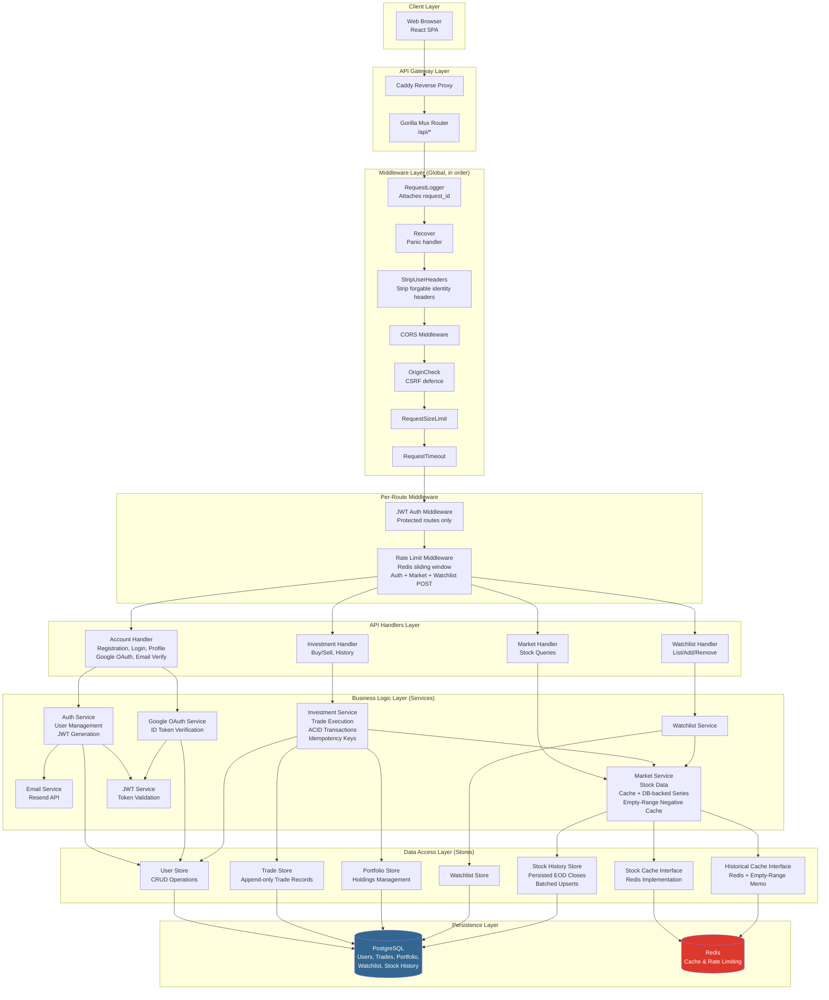
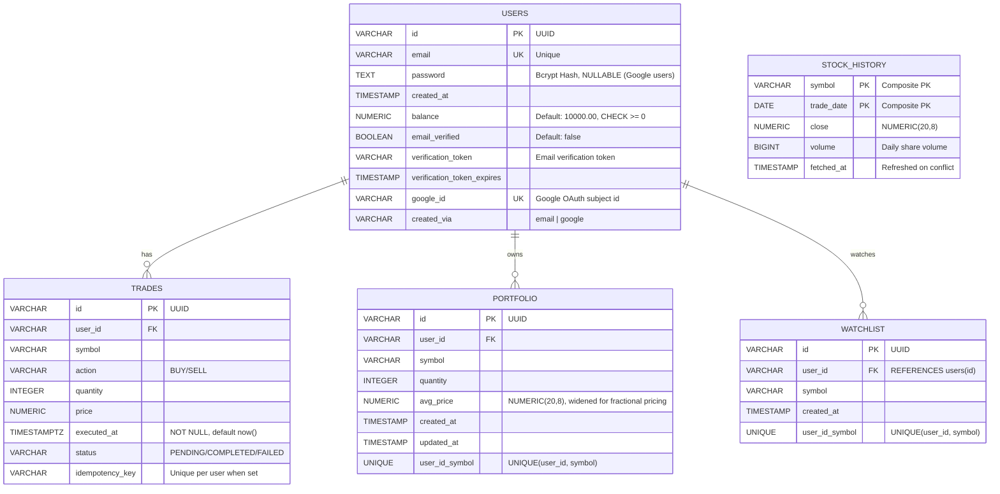
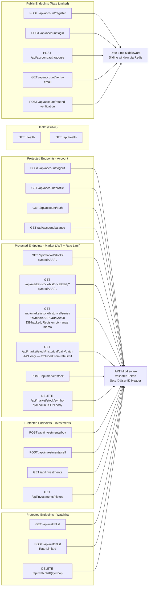
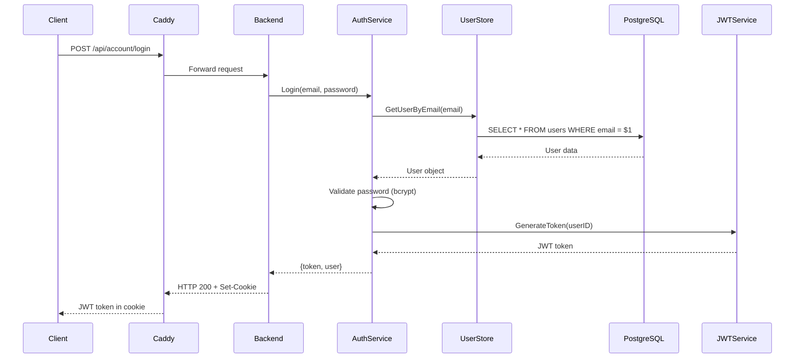
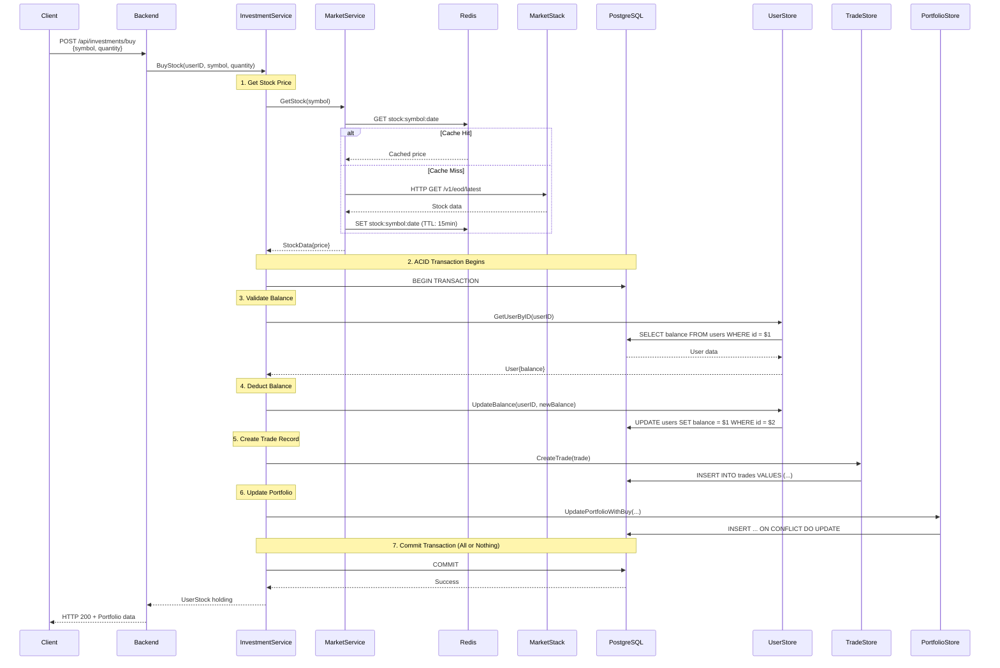
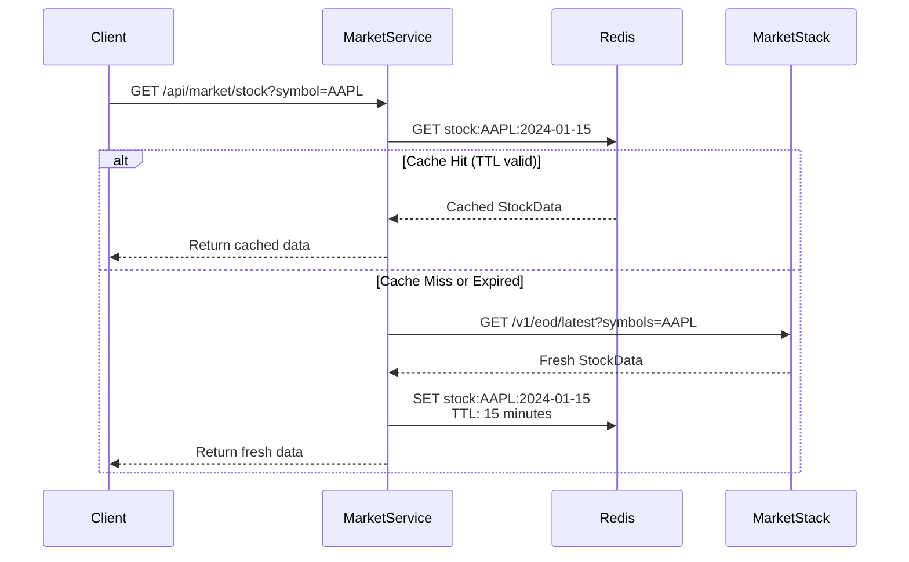
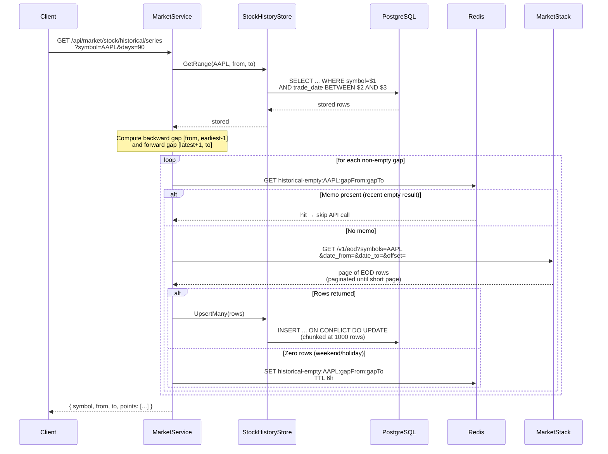
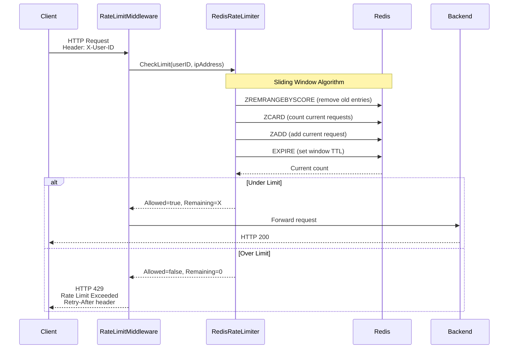

# PaperTrader - System Architecture Documentation

## Table of Contents
1. [Deployment Architecture](#deployment-architecture)
2. [Application Architecture](#application-architecture)
3. [Database Schema](#database-schema)
4. [API Architecture](#api-architecture)
5. [Data Flow Diagrams](#data-flow-diagrams)
6. [Technology Stack](#technology-stack)

---

## Deployment Architecture

---

## Application Architecture

---

## Database Schema

> `STOCK_HISTORY` is a **shared cache table** — no relationship to `USERS`. Every user that views the same symbol's chart hits the same rows.

### Table Details

#### users
- **Purpose**: User accounts and authentication (email/password and Google OAuth)
- **Key Fields**:
  - `id`: UUID primary key
  - `email`: Unique email address
  - `password`: Bcrypt hashed password (cost factor 12). **Nullable** — null for Google-OAuth-only accounts.
  - `balance`: Starting balance $10,000.00 (CHECK constraint `balance >= 0`)
  - `email_verified`: Whether the user has confirmed their email (default `false`)
  - `verification_token` / `verification_token_expires`: Token issued for email verification flow
  - `google_id`: Unique Google subject id for OAuth-linked accounts
  - `created_via`: `email` or `google` — how the account was provisioned

#### trades
- **Purpose**: Append-only audit log of all buy/sell transactions
- **Key Fields**:
  - `id`: UUID primary key
  - `user_id`: Foreign key to users
  - `symbol`: Stock symbol (e.g., "AAPL")
  - `action`: "BUY" or "SELL"
  - `executed_at`: TIMESTAMPTZ, NOT NULL, defaults to `CURRENT_TIMESTAMP` (replaces the legacy `date VARCHAR` column)
  - `status`: Transaction status
  - `idempotency_key`: Optional client-supplied key; unique per `user_id` (partial unique index) so retried buy/sell requests don't double-execute
- **Triggers**: `BEFORE UPDATE` and `BEFORE DELETE` triggers raise an exception — the table is enforced as append-only at the database level.
- **Indexes**: `(user_id, executed_at DESC)` for trade history queries.

#### portfolio
- **Purpose**: Current holdings per user
- **Key Fields**:
  - `id`: UUID primary key
  - `user_id`: Foreign key to users
  - `symbol`: Stock symbol
  - `quantity`: Number of shares
  - `avg_price`: Weighted average purchase price, `NUMERIC(20,8)` (widened from `NUMERIC(15,2)` to support fractional pricing)
  - Unique constraint on (user_id, symbol)

#### watchlist
- **Purpose**: Per-user list of symbols the user is tracking (independent of holdings)
- **Key Fields**:
  - `id`: UUID primary key
  - `user_id`: Foreign key to `users(id)`
  - `symbol`: Stock symbol
  - `created_at`: When the symbol was added
  - Unique constraint on (user_id, symbol)
- **Indexes**: `idx_watchlist_user_id` on `user_id` for fast list lookups.

#### stock_history
- **Purpose**: Persisted EOD closes per symbol; backs the stock-detail price chart so repeat loads are served from Postgres rather than MarketStack.
- **Key Fields**:
  - `symbol` + `trade_date`: composite primary key (no surrogate id)
  - `close`: `NUMERIC(20,8)` — matches `portfolio.avg_price` precision
  - `volume`: `BIGINT` — high-volume tickers exceed `INTEGER`
  - `fetched_at`: refreshed on every conflicting upsert; useful for staleness audits
- **Indexes**: Primary key alone — every chart query is a `(symbol, trade_date BETWEEN ...)` range scan covered by the PK.
- **Notes**: Independent of users. Written by `MarketService.GetHistoricalSeries` via batched upserts (`upsertBatchSize = 1000` to stay under the Postgres parameter cap).

---

## API Architecture

### API Endpoint Summary

| Method | Endpoint | Authentication | Description |
|--------|----------|----------------|-------------|
| GET | `/health` | None | Liveness/readiness probe (DB + Redis ping) |
| GET | `/api/health` | None | Same probe under the `/api` prefix for the frontend |
| POST | `/api/account/register` | Rate Limit | User registration |
| POST | `/api/account/login` | Rate Limit | User login (returns JWT cookie) |
| POST | `/api/account/auth/google` | Rate Limit | Sign in / sign up via Google ID token |
| GET | `/api/account/verify-email` | Rate Limit | Confirm email via token query param |
| POST | `/api/account/resend-verification` | Rate Limit | Resend verification email |
| POST | `/api/account/logout` | JWT | User logout |
| GET | `/api/account/profile` | JWT | Get user profile |
| GET | `/api/account/auth` | JWT | Check authentication status |
| GET | `/api/account/balance` | JWT | Get user balance |
| GET | `/api/market/stock` | JWT + Rate Limit | Get current stock price (`?symbol=AAPL`) |
| GET | `/api/market/stock/historical/daily` | JWT + Rate Limit | Get latest + previous close (single point) |
| GET | `/api/market/stock/historical/series` | JWT + Rate Limit | Get daily-close time series (`?symbol=&days=`); served from `stock_history` table with MarketStack fill-in for missing dates and a Redis negative cache for empty windows |
| GET | `/api/market/stock/historical/daily/batch` | JWT (no rate limit) | Batched historical fetch — excluded from rate limiting because it reduces total MarketStack calls |
| POST | `/api/market/stock` | JWT + Rate Limit | Create / refresh stock cache entry |
| DELETE | `/api/market/stock/symbol` | JWT + Rate Limit | Invalidate cached stock; **symbol provided in JSON request body** (path is literal `/stock/symbol`) |
| POST | `/api/investments/buy` | JWT | Buy stock shares |
| POST | `/api/investments/sell` | JWT | Sell stock shares |
| GET | `/api/investments` | JWT | Get user portfolio holdings |
| GET | `/api/investments/history` | JWT | Get user trade history (append-only ledger) |
| GET | `/api/watchlist` | JWT | List watched symbols |
| POST | `/api/watchlist` | JWT + Rate Limit | Add a symbol (rate-limited because it calls MarketStack) |
| DELETE | `/api/watchlist/{symbol}` | JWT | Remove a symbol from the watchlist |

> **Rate limiting notes**
> - The public auth endpoints (`/register`, `/login`, `/auth/google`, `/verify-email`, `/resend-verification`) are rate-limited even though they don't require a JWT, to deter brute-force and abuse.
> - All `/api/market/*` routes are rate-limited **except** `/stock/historical/daily/batch`, which is intentionally exempt (`backend/internal/api/market/routes.go:23-34`) because batching reduces upstream API calls.
> - On the watchlist, only `POST` is rate-limited (it calls MarketStack); `GET` and `DELETE` are DB-only and exempt.

---

## Data Flow Diagrams

### Authentication Flow

### Buy Stock Transaction Flow (ACID)

### Market Data Caching Flow

### Stock-History Series Fetch (DB-backed with gap fill)

The chart endpoint reads from Postgres first and only consults MarketStack
for dates that aren't already persisted. Empty MarketStack responses (weekend
gaps, holidays) are memoized in Redis so they don't burn quota on every load.

### Rate Limiting Flow

---

## Technology Stack

### Frontend
- **Framework**: React 18 (TypeScript)
- **HTTP Client**: Fetch API
- **Routing**: React Router v6
- **Google OAuth**: `@react-oauth/google`
- **Build Tool**: Create React App (react-scripts) / npm
- **Type Checking**: TypeScript 5.9 (`tsc --noEmit`)

### Backend
- **Language**: Go 1.25.0
- **HTTP Framework**: Gorilla Mux
- **Database Driver**: lib/pq (PostgreSQL)
- **Migrations**: golang-migrate/migrate/v4 (embedded SQL migrations runner)
- **Cache/Queue**: go-redis/v9
- **Authentication**: JWT (golang-jwt/jwt/v5)
- **Google OAuth**: `google.golang.org/api` (ID token verification)
- **Email**: `resend-go/v2` (Resend API for verification emails)
- **Password Hashing**: golang.org/x/crypto/bcrypt
- **Decimal Math**: shopspring/decimal (for monetary values)

### Infrastructure
- **Reverse Proxy**: Caddy 2
- **Containerization**: Docker & Docker Compose
- **Database**: PostgreSQL 15-alpine
- **Cache**: Redis 7-alpine

### External Services
- **Market Data**: MarketStack API (REST)

### Security Features
- JWT-based authentication
- Bcrypt password hashing (cost factor 12)
- CORS middleware
- Rate limiting (sliding window, per-user and per-IP)
- SQL injection protection (parameterized queries)
- ACID transactions for financial operations

---

## Key Architectural Decisions

### 1. ACID Transactions for Financial Operations
- All buy/sell operations execute within a single PostgreSQL transaction
- Ensures atomicity: balance update + trade record + portfolio update happen together
- Eliminates distributed transaction issues from previous MongoDB architecture

### 2. Redis Caching Strategy
- **Stock Prices**: 15-minute TTL (balances freshness with API costs)
- **Historical Data**: 24-hour TTL (daily data changes once per day)
- **Rate Limiting**: Sliding window using Redis sorted sets

### 3. Materialized Portfolio Table
- Portfolio holdings stored as a materialized table in PostgreSQL
- Updated atomically with trades in the same transaction
- Eliminates need to recalculate from trade history

### 4. Service Layer Pattern
- Business logic separated from HTTP handlers
- Services are testable and reusable
- Clean separation of concerns: API → Service → Data

### 5. DBTX Interface
- Common interface for `*sql.DB` and `*sql.Tx`
- Enables transaction support across all data stores
- Allows services to manage transactions without tight coupling

---

## Performance Considerations

### Caching
- Stock prices cached for 15 minutes (reduces MarketStack API calls)
- Historical data cached for 24 hours (daily data)
- Redis in-memory storage provides sub-millisecond response times

### Database
- PostgreSQL connection pooling (10 max connections, 5 idle — sized to PostgreSQL `max_connections=50` on the e2-micro deployment)
- Indexed queries on `user_id` in portfolio and trades tables
- Unique constraint on `(user_id, symbol)` in portfolio for fast lookups

### Rate Limiting
- Per-user limit: 100 requests/hour
- Per-IP limit: 200 requests/hour
- Sliding window algorithm for accurate time-based limiting

---

## Scalability Notes

### Current Architecture
- Monolithic backend application
- Single PostgreSQL instance
- Single Redis instance
- Suitable for small to medium traffic

### Potential Improvements
- **Horizontal Scaling**: Add backend replicas behind load balancer
- **Database**: Read replicas for read-heavy workloads
- **Cache**: Redis Cluster for high availability
- **Message Queue**: Add queue system for async operations (e.g., email notifications)

---

## Deployment Notes

### Docker Compose Services
1. **caddy**: Reverse proxy and TLS termination
2. **frontend**: React application (built as static assets)
3. **backend**: Go HTTP server
4. **postgres**: PostgreSQL database with persistent volume
5. **redis**: Redis cache with persistent volume

### Health Checks
- PostgreSQL: `pg_isready` command
- Redis: `redis-cli ping` command
- Backend depends on database health before starting

### Environment Variables
- `DATABASE_URL`: PostgreSQL connection string
- `REDIS_URL`: Redis connection string
- `MARKETSTACK_API_KEY`: External API key
- `JWT_SECRET`: Secret for JWT signing
- `FRONTEND_URL`: CORS allowed origin

---

*Last Updated: 2026-05-03*
*Architecture Version: 2.2 — adds stock-history series endpoint backed by `stock_history` table with Redis empty-range negative cache, plus stock-detail page on the frontend (2.1 added watchlist, Google OAuth, email verification, idempotency keys on trades, and append-only trade triggers)*
